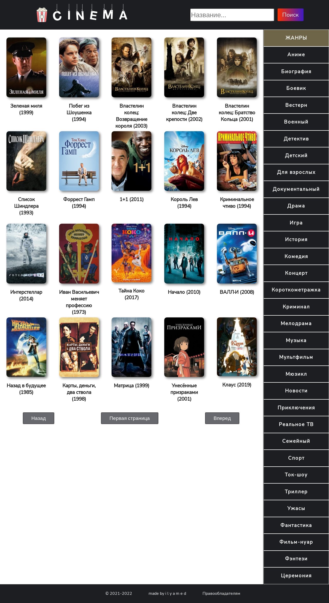
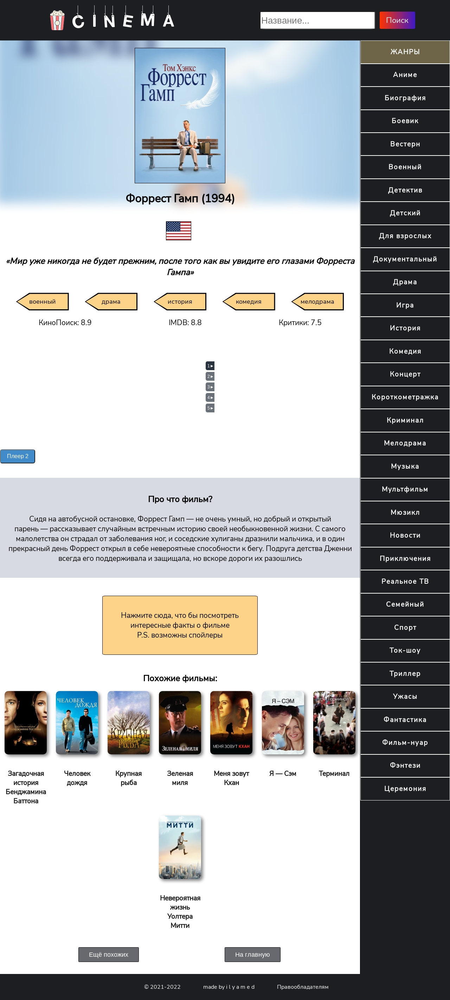
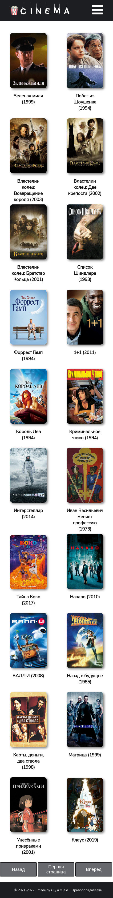
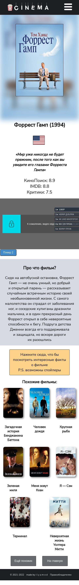

<h1 align="center">Welcome to React Movie Theater 👋</h1>
<p>
</p>

> Free online movie theater based on react+scss stack

### 🏠 [Homepage](https://terro216.github.io/cinema-react/)

## Screenshots
<details><summary>PC version</summary>

  <br/>

</details>
<details><summary>Mobile version</summary>

  <br/>

</details>

## Features
You can:
- View the top 250 best films list
- Find a movie by keyword
- Watch the best movies by a popular genres
- Literraly watch any film and read his description and interesting facts

## Install

```sh
npm install
```

## Usage

```sh
npm start
```

## Author

🦔 **ilya med**

* Website: [https://ilyamed.site/](ilyamed.site)
* Github: [@Terro216](https://github.com/Terro216)

## 🤝 Contributing

Contributions, issues and feature requests are welcome!<br />Feel free to check [issues page](https://github.com/Terro216/cinema-react/issues). 

## Show your support

Give a ⭐️ if you liked this project!
